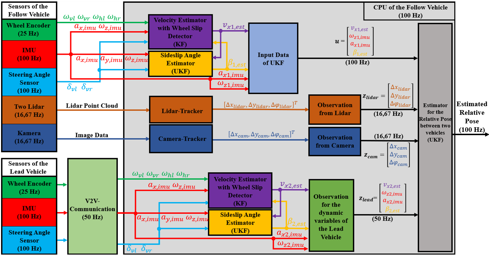
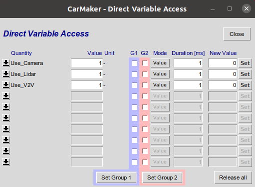
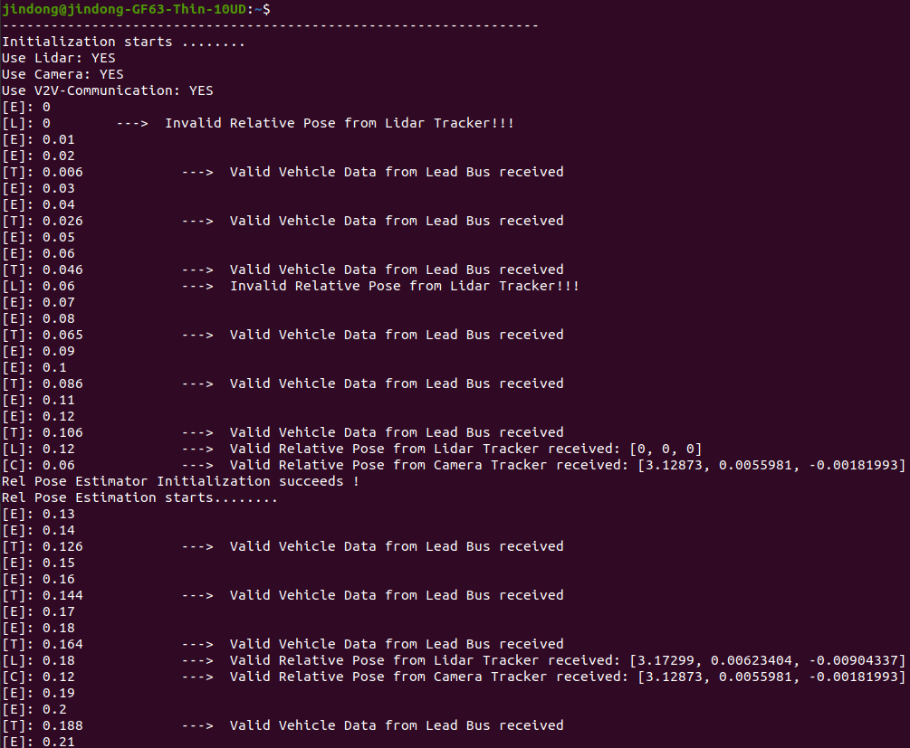
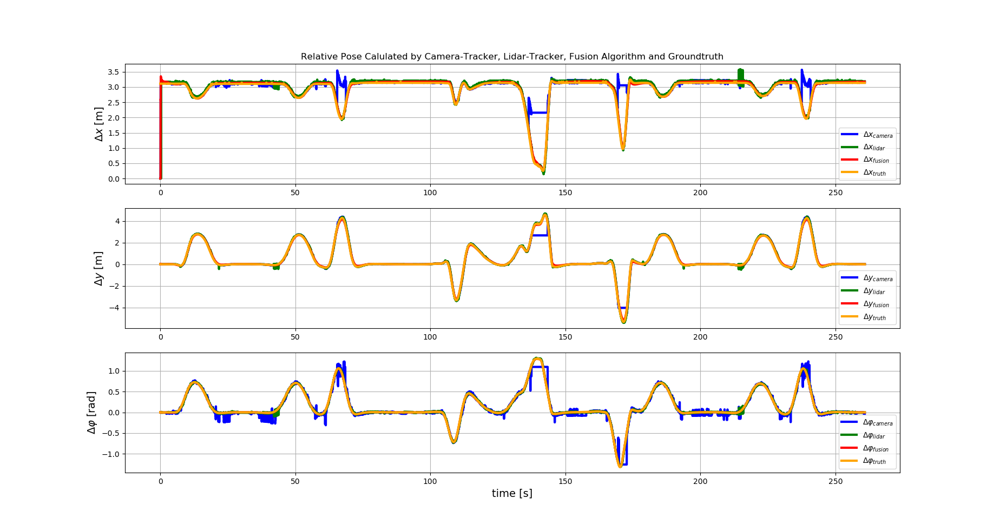
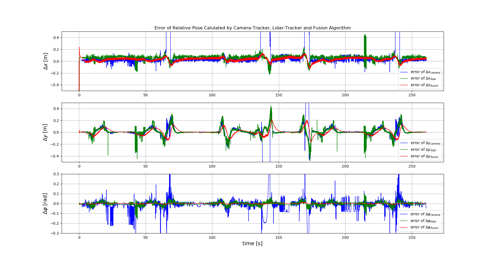
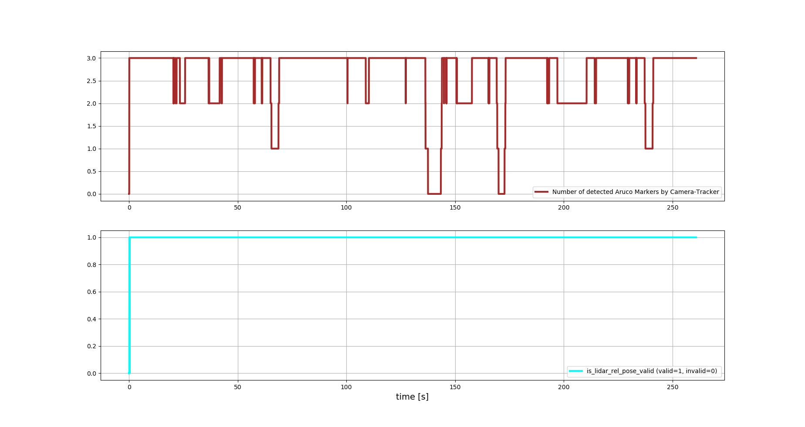

# Relative Positioning with LiDAR, Camera, IMU and Vehicle Date Fusion for Platooning ([pdf](support_files/paper/Masterthesis_DE_Jindong_Shi.pdf))
This repository contains codes for a UKF based relative pose estimator between two vehicles in urban platooning, which fuses the detected relative pose by lidar and camera, as well as the IMU and vehicle data. The basic fusion concept is shown in following image. The Algorithm is implemented in C++ and integrated in the simulation platform CarMaker 11.0. 


This project is my master thesis and based on the following previous student work in institute ITIV of KIT:
- Patrick-Leon Mueller, "Lidar Tracker for Detection and Tracking of the Vehicle in Front for Platooning"
  ```shell script
  Project Files:
       LidarDetectionAndTracking.h
       LidarDetectionAndTracking.cpp
       StateAndMatrix.h
  ```

- Dimitar Dimitrov, "Relative Positioning for Bus Platooning Using Aruco Markers and Single Monocular Camera"
  ```shell script
  Project Files:
       CvMarkerOperationsClass.cpp
       CvMarkerOperationsClass.hpp
       CvOperationsWrapper.cpp
       CvOperationsWrapper.hpp
       RSDS_CameraClient.c
  ```

The source files above would be used as Lidar Tracker and Camera Tracker in my fusion concept. Because these files do not belong to my work, they would not be put in this repository.


## 1. Prerequisites
1.1. [Ubuntu 20.04](https://releases.ubuntu.com/focal/)

1.2. [CarMakerOffice-linux-11.0](https://ipg-automotive.com)

1.3. Install Dependencies of CarMakerOffice-linux-11.0 on Ubuntu 20.04
```shell script
    # For Graphics adapter
    sudo apt-get install libopengl0
    sudo apt-get install libglx0
    sudo apt-get install libegl1
    # For rebuilding the CarMaker executable
    sudo apt-get install build-essential
    sudo apt-get install libusb-1.0-0-dev
```
1.4. NVIDIA Graphic Card with Compute Capability >= 5.0 is required for LidarRSI
- Check the Compute Capability of your Graphic Card [hier](https://developer.nvidia.com/cuda-gpus) 

1.5. License for CarMaker and SimNet

1.6. Install Extern Libraries for this Project
- Please read [Extern_Libraries_Guide.md](support_files/Extern_Libraries_Guide.md)

## 2. Build CarMaker Simulation Project on Ubuntu 20.04
2.1. Here we use Makefile to build this carmaker project on linux systems
- Please read [CarMaker_Build_on_Linux_Guide.md](support_files/CarMaker_Build_on_Linux_Guide.md)
  
2.2. Another way for building carmaker project on linux is using [Eclipse IDE for C/C++ Developers](https://www.eclipse.org/downloads/packages/) as IDE

## 3. Run the CarMaker Simulation
3.1. open CarMaker Gui:
```shell script
open a new terminal
CM &
```
3.2. run SimNet
```shell script
Application > SimNet Configuration > Misc > Start Applications
(Maybe you need to change the following SimNet Paramters, when you use SimNet on your linux system at first time:  
     --->   nEgoVhcls = 2,  AppPath = ./src/CarMaker.linux64)
```
3.3. connect as master application
```shell script
Application > Configuration/Status > Command(executable): src/CarMaker.linux64, Command line options: -SimNet 0 > Start & Connect
```
3.4. select a SimNet based TestRun and start the simulation
```shell script
File > Open > select a TestRun, e.g. "Sensorfusion_UrbanRoad_RuralRoad_Expressway_Aruco_1B2S_SimNet"
File > IPGMovie
File > IPGControl 
Start
```

## 4. Set Paramters
4.1.  [Vehicle Model](/src/sensorfusion/config/vehicle_parameters_config.yaml)

4.2.  [Relative Pose Estimator](/src/sensorfusion/config/rel_pose_estimator_config.yaml)

4.3. [Velocity Estimator](/src/sensorfusion/config/velocity_estimator_config.yaml)

4.4. [Sideslip Angle Estimator](/src/sensorfusion/config/sideslip_angle_estimator_config.yaml)

- You don't need to rebuild the project, if you only change the parameter values in yaml-files.

4.5.  [Run Mode (Use/Don't Use Lidar/Camera/V2V)](/src/sensorfusion/config/run_mode_config.yaml)

- You can also use Direct Variable Access to change its value, when your simulation runs:
  

4.6. [Show Timeline of Received Data in Terminal (#define ShowTimeLine 1)](/src/sensorfusion/headers/vehicle_positioning_flow.h)



## 5. Result
Some calculate results of simulations can be found in the folder (./result). They are some csv data files, which are automated storaged by Carmaker GUI, and you can load them in IPGControl or plott them with python. 
As an example, the results for TestRun "Sensorfusion_UrbanRoad_RuralRoad_Expressway_Aruco_1B2S_SimNet" are shown as follows:




## 6. Code Style
- This Project holds the [Google C++ Style Guide](https://google.github.io/styleguide/cppguide.html)
